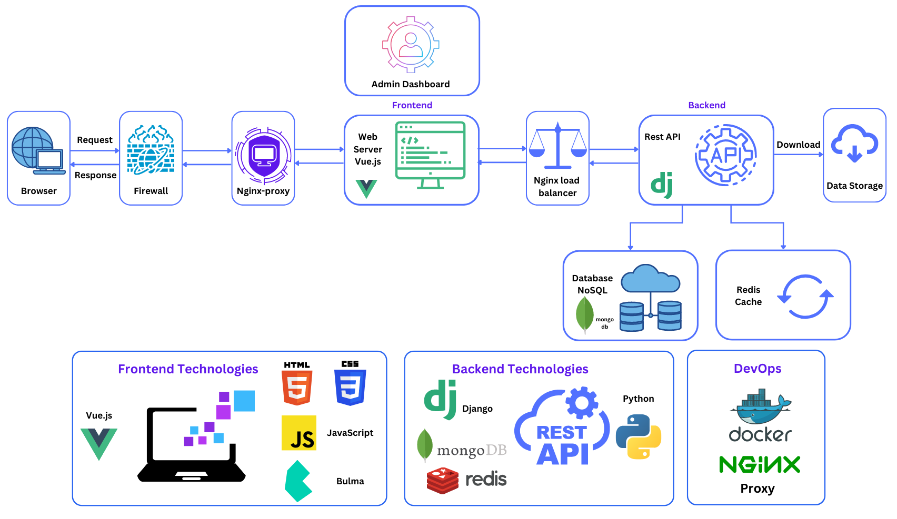

# Data Management Web Services - Built Environment Test Data - betestdata.eu

**[Explore datasets](https://www.betestdata.eu/explore) with ease using taxonomy filtering, allowing you to quickly identify the specific experimental datasets you need and download them effortlessly.**

**Dataset metadata is generated through admin dashboard**

### Project Technology Stack
This project was built using the following technologies

- Frontend framework: Vue.js
- Backend framework: django (Rest API)
- Database: MongoDb
- Styling: CSS, Bulma
- Deployment: Docker, Nginx-proxy
- API Testing: Rest APIClient, Postman

*Note: a small portion of codebase is shared only*

### Objective
Built Environment Test Data is a service maintained and hosted by the [University of Pavia](https://web-en.unipv.it/) in collaboration with the [EUCENTRE Foundation](https://www.eucentre.it/) that provides open access to experimental test data on the performance of buildings and infrastructure. This data has been generated by many experimental tests in Europe and can be used for the validation and calibration of numerical models required to assess the vulnerability of buildings and infrastructure. Users can easily search our database of experimental test data using the [Explore Datasets](https://www.betestdata.eu/explore) page. Web services are also available for automated searching of the database. We accept open experimental test data from the community, to which we will assign a Creative Commons [CC-BY license](https://creativecommons.org/licenses/by/4.0/) and a Digital Object Identifier (DOI). Please contact us [here](https://www.betestdata.eu/contact) for more information on how to contribute your data. We adhere to the [Data Policy](https://www.epos-eu.org/sites/default/files/2020-12/EPOS%20DATA%20POLICY_July2018.pdf) of the European [Plate Observing System (EPOS)](https://www.epos-eu.org/).
